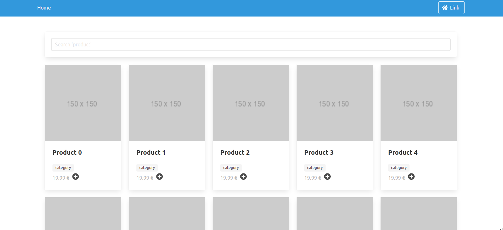

## A website template for Common Lisp

Start building an app quickly.

* Hunchentoot, [Easy-routes](https://lispcookbook.github.io/cl-cookbook/web.html)
* [Djula](https://mmontone.github.io/djula/) templates
* a welcome screen
* a form to search products ("product 1"…)
* a list of products
* run as a script or build a binary.

Uses [Bulma CSS](https://bulma.io) and used [Bulma templates examples](https://bulmatemplates.github.io/bulma-templates/).

See also the [Caveman](https://github.com/fukamachi/caveman) framework
that provides a project skeleton.

Welcome screen:

Searching products:

## How to run the app

Two possibilities to run it from the command line:

    rlwrap sbcl --load run.lisp

In that case, we are dropped into the Lisp REPL, so we can interact
with the running application. It is specially useful to reload
settings (contact information,…).

Or build the binary and run it:

    make build
    ./myproject

Set the port:

    PORT=9999 rlwrap sbcl --load run.lisp

## Develop

Load `myproject.asd` (`C-c C-k` in Slime), `(ql:quickload :myproject)` and then `(start)`.

TODO:

* load static files
* anything more useful for a web app

See also:

* the [real world app](https://github.com/vindarel/abstock) from where I extracted this template (it reads a DB, it has a shopping basket and a validation form that sends an email to the owner).
* my preliminary notes on live-reloading a lisp web app: https://github.com/vindarel/lisp-web-live-reload-example
* how to connect to a remote running image with a Swank server: https://lispcookbook.github.io/cl-cookbook/debugging.html#remote-debugging
* https://lispcookbook.github.io/cl-cookbook/web.html
* https://github.com/CodyReichert/awesome-cl#web-frameworks

## Licence

WTFPL
